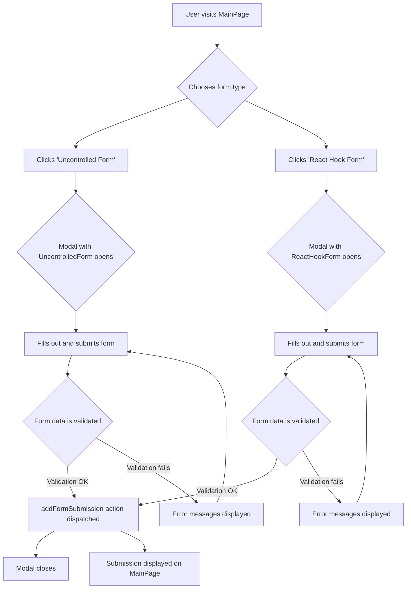

```mermaid
graph TD
    A[User visits MainPage] --> B{Chooses form type};
    B --> C[Clicks 'Uncontrolled Form'];
    B --> D[Clicks 'React Hook Form'];

    C --> E{Modal with UncontrolledForm opens};
    D --> F{Modal with ReactHookForm opens};

    E --> G[Fills out and submits form];
    F --> H[Fills out and submits form];

    G --> I{Form data is validated};
    H --> J{Form data is validated};

    I -- Validation OK --> K[addFormSubmission action dispatched];
    J -- Validation OK --> K;

    I -- Validation fails --> L[Error messages displayed];
    J -- Validation fails --> M[Error messages displayed];

    K --> N[Modal closes];
    K --> O[Submission displayed on MainPage];

    L --> G;
    M --> H;
```
